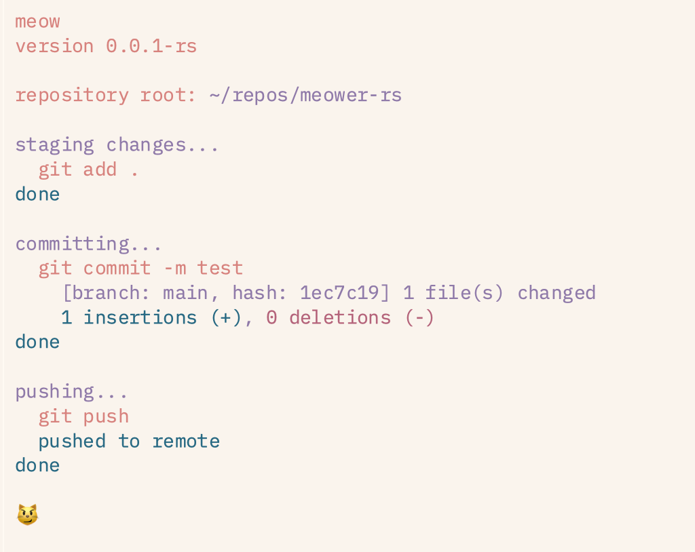

# meower-rs
**this is incomplete. use [this](https://github.com/ellipticobj/meower) instead**

a rust rewrite of the [original meower](https://github.com/ellipticobj/meower)

# installation
prerequisites:
- cargo installed (from [here](https://rustup.rs))

clone this repo
```bash
git clone https://github.com/ellipticobj/meower-rs && cd meower-rs
```

install using cargo
```bash
cargo install --path .
```

make sure ~/.cargo is on your path!

# screenshots


# in progress

- [ ] add ~~progress bars +~~ spinners
- [ ] add flags for running git commands
- [x] proper output
- [x] custom clap error output
- [x] custom --version styling
- [x] fix commit output printing
- [x] add flags for commit message
- [x] custom commit command output
- [x] add flags for setting upstream
- [x] add flags for staging certain files
- [x] add force and force with lease flags
- [x] add functions to print normal output, logs, errors, etc
- [x] exit gracefully instead of panicking when the command returns an error
