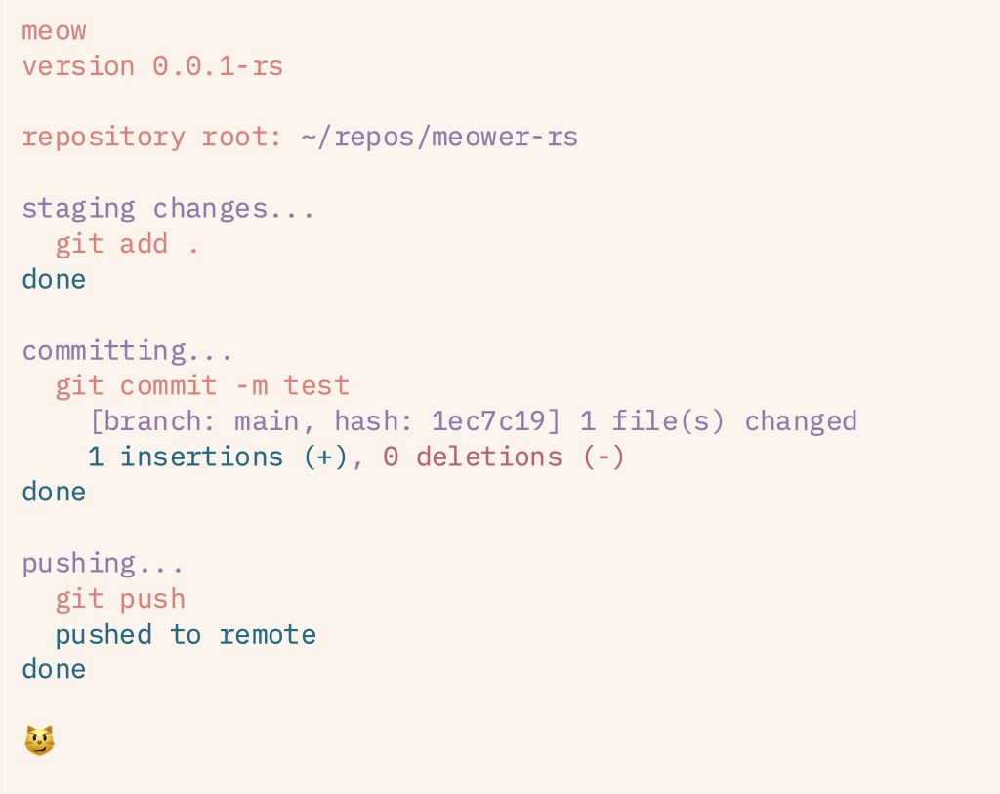

# meower-rs
a rust rewrite of the [original meower](https://github.com/ellipticobj/meower)

# installation
prerequisites:
- cargo installed (from [here](https://rustup.rs))

clone this repo
```bash
git clone https://github.com/ellipticobj/meower-rs && cd meower-rs
```

install using cargo
```bash
cargo install --path .
```

make sure ~/.cargo is on your path!

# usage
run `meow -h` for the full flag list. quick reference:

- `meow "commit message"` — stage everything, commit, and push in one go
- `meow -a file1 file2 "message"` — stage only the specified files
- `meow -s` / `-c` / `-p` — run only the stage / commit / push step
- `meow -u <branch> "message"` — sets upstream on the push
- `meow -f` — push with `--force-with-lease`; `-ff` escalates to `--force`
- `meow -d ...` — dry run: print the git commands without executing them
- `meow -v` — verbose debug output (repeat for more, up to `-vvv`)
- `meow -E` — exit immediately on any pipeline error (default is best-effort)
- `meow --add-remote <url>` / `--remove-remote` — experimental origin management

# screenshots


# todo
- [ ] add spinners for long-running git operations
- [ ] wire up `--run` for arbitrary git command passthrough
- [ ] allow configurable remote name (currently hardcoded to `origin`)
- [ ] harden `formatoptionsline` — the short-flag parser is fragile
- [ ] decide the fate of `_fatalerror` (either use it or delete it)

# done
- [x] fix the help flag
- [x] proper output
- [x] custom clap error output
- [x] custom --version styling
- [x] fix commit output printing
- [x] add flags for commit message
- [x] custom commit command output
- [x] add flags for setting upstream
- [x] add flags for staging certain files
- [x] add force and force with lease flags
- [x] add functions to print normal output, logs, errors, etc
- [x] exit gracefully instead of panicking when the command returns an error
- [x] add the basic features (--push, --add, --commit, --stage)
- [x] fix push function output (parsed into a compact summary)
- [x] add experimental remote add/remove
